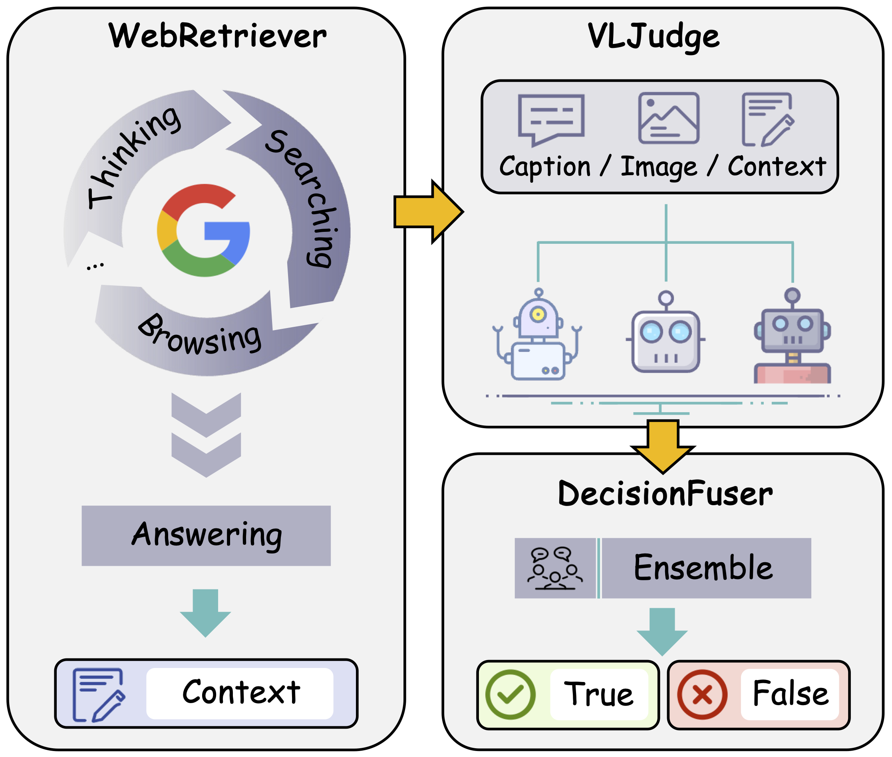
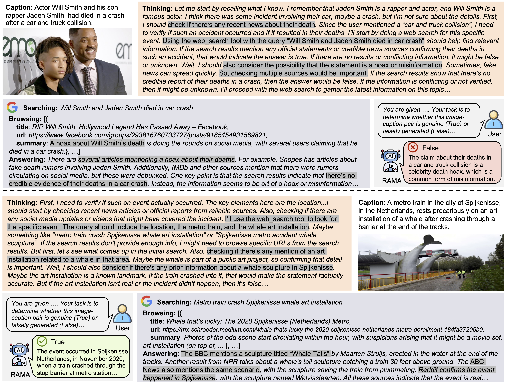

# RAMA: Retrieval-Augmented Multi-Agent Framework for Misinformation Detection in Multimodal Fact-Checking

[](https://arxiv.org/abs/2507.09174)

## Introduction

The rapid proliferation of multimodal misinformation presents significant challenges for automated fact-checking systems, especially when claims are ambiguous or lack sufficient context. We introduce RAMA, a novel retrieval-augmented multi-agent framework designed for verifying multimedia misinformation. RAMA incorporates three core innovations: (1) strategic query formulation that transforms multimodal claims into precise web search queries; (2) cross-verification evidence aggregation from diverse, authoritative sources; and (3) a multi-agent ensemble architecture that leverages the complementary strengths of multiple multimodal large language models and prompt variants.

<figure align="center">
    
    <figcaption>Overview of the RAMA workflow. RAMA consists of three cascaded modules: WebRetriever, VLJudge, and DecisionFuser.</figcaption>
</figure>

This work is a submission for the [ACMMM25 - Grand Challenge on Multimedia Verification](https://multimedia-verification.github.io/). The performance (F1-score) achieved on the Public Test is 91.00%, while the performance on the Hidden Test is 76.61%, verified by the Competition Organizer. Below, we present two representative cases that demonstrate the effectiveness of the RAMA framework in detecting multimedia misinformation.

<figure align="center">
    
    <figcaption><strong>Case 1:</strong> Debunking a Celebrity Death Hoax. RAMA effectively distinguishes between viral misinformation and factual reporting through evidence-based reasoning. <strong>Case 2:</strong> Verifying an Unlikely Real Event. RAMA successfully overcomes cognitive biases in visual interpretation by grounding its analysis in retrieved factual evidence.</figcaption>
    </figcaption>
</figure>

We welcome you to experience and use our solution!

## Model Preparation
The following huggingface models are required:
- `GAIR/DeepResearcher-7b`
- `Qwen/Qwen2.5-VL-72B-Instruct-AWQ`
- `OpenGVLab/InternVL3-78B-AWQ`

You can download these models by runing **cell 2** in the `searchandinfer.ipynb` notebook. All models will be downloaded to local path <span style="background:gray;">SubTask/Models</span>.

## Search API
We use the [Serper](https://serper.dev/) Google Search API. For light usage, a free account is sufficient.

You can modify the api-key in **tools.py, line 120** to your google api key
```python
    headers = { 'X-API-KEY': 'your google api key', 'Content-Type': 'application/json' } 
```

## Instructions
All code is located in the `searchandinfer.ipynb` notebook, which contains **7 cells**.

Our pipeline uses multi-modal large language models, you may need an **A100 GPU** at least to run the notebook.

### Cell 1: Path confirmation
This cell defines the **work directory**, the **test json file path** and save path of some **intermediate results** in our pipeline. Their meanings are as follows:
- WORK_DIR: The directory where the `searchandinfer.ipynb` notebook is located.
- TEST_JSON_PATH: path of the **public_test_acm.json** or **private_test_acm.json**
- SEARCH_INFO_PATH: path of the **agent search results** from the internet. Please refer to **cell 3** for more details.
- QWEN_PATH1/2, INTERN_PATH1: path of the multi-modal models **judgement results**. Please refer to **cell 4, 5** for more details.
- VOTE_PATH: path of the **final results** by aggregating different judgement results. Please refer to **cell 6** for more details.

### Cell 2: Model Preparation
This cell uses huggingface-cli api to download the required model to your local path.

### Cell 3: Web Search via Agent
This cell uses agent techniques to query a search engine and browser for information from the internet.

Before running this cell, start the vllm server of the `GAIR/DeepResearcher-7b` model with the following command:

```bash
python -m vllm.entrypoints.openai.api_server \
    --model GAIR/DeepResearcher-7b \
    --served-model-name factmodel \
    --gpu-memory-utilization 0.9 \
    --swap-space 16 \
    --max-model-len 60000 \
    --max-num-seqs 16 \
    --port 3001 \
    --api-key 123 \
    --tensor-parallel-size 2
```

After the vllm service is started, run **cell 3** and the search results will be saved to path <span style="background:gray;">Sub_Task/cosmos_anns_acm/cosmos_anns_acm/acm_anns/public_test_acm_search_withbrowser.json</span> by default.

### Cell 4 & Cell 5: Multi-modal Inference
**Notification: Before running cell 4 and cell 5, please restart the kernel to release GPU memory.**

**Please rerun the cell 1, skip cell 2 and 3, then run cell 4 or cell 5.**

These cells use both the `Qwen2.5-VL` and `InternVL3` multi-modal models with different prompts to conduct reasoning.
Each model and prompt will output a final judgment: True, False, or Unknown. We generate a total of three different results.

The final judgment results will be saved in <span style="background:gray;">Sub_Task/cosmos_anns_acm/, cosmos_anns_acm/acm_anns</span>, the default three file names are:

- public_test_acm_search_vl_search.json
- public_test_acm_search_vl_prompt.json
- public_test_acm_internvl_prompt.json

### Cell 6: Voting
This cell aggregates the three output files from the multi-modal models and performs a voting process to generate the final result file.

By default, the final result will be saved in <span style="background:gray;">public_final_pred.json</span> file.

### Cell 7: Metrics Calculation
This cell obtains the final result and the ground truth labels to calculate below 5 metrics: **accuracy**, **precision**, **recall**, **F1-score** and **Matthews correlation coefficient (MCC)**.

## Process private_test.json
To run the code on **private_test.json**, you can change the **TEST_JSON_PATH** parameter in `searchandinfer.ipynb`, which is in the **cell 1, line 1**.

After changing the **TEST_JSON_PATH** parameter, you also need to put the private test images in the path <span style="background:gray;">Sub_Task/images_test_acm/</span> to ensure that they can be read correctly.

### Optional
Our pipeline needs to save many intermediate results, such as agent search results, multi-modal inference results and voting results. You can modify the save path parameter in **cell 1** to **avoid overwriting the public_test.json results**, for example, replace the *"public"* with *"private"*.

## Citation

If you find our paper and code useful for your research, please consider giving a star :star: and citation :pencil: :)

```BibTeX
@misc{yang2025rama,
      title={RAMA: Retrieval-Augmented Multi-Agent Framework for Misinformation Detection in Multimodal Fact-Checking}, 
      author={Shuo Yang and Zijian Yu and Zhenzhe Ying and Yuqin Dai and Guoqing Wang and Jun Lan and Jinfeng Xu and Jinze Li and Edith C. H. Ngai},
      year={2025},
      eprint={2507.09174},
      archivePrefix={arXiv},
      primaryClass={cs.CL},
      url={https://arxiv.org/abs/2507.09174}, 
}
```
